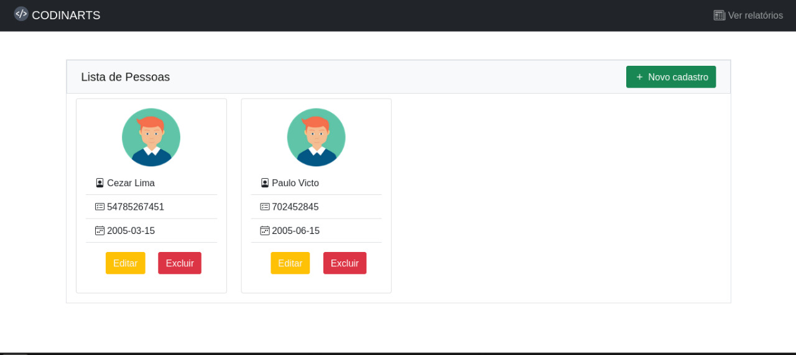

# codinarts-web
Bem-vindo(a) ao sistema de clientes

### Features

- [x] Interface de usuário
- [x] Interface de Contatos
- [x] Interface de Endereços
- [x] Interface de Inquilinos
- [ ] Feedbacks

<h1 align="center">
  
</h1>

## Para iniciar, siga as instruções abaixo:
Siga todas as etapas

#### Instalação
```
$ npm install
```

### Iniciar
```
npm run serve
```


## Ferramentas

1. apexcharts
2. axios
3. bootstrap-vue
4. core-js
5. vue
